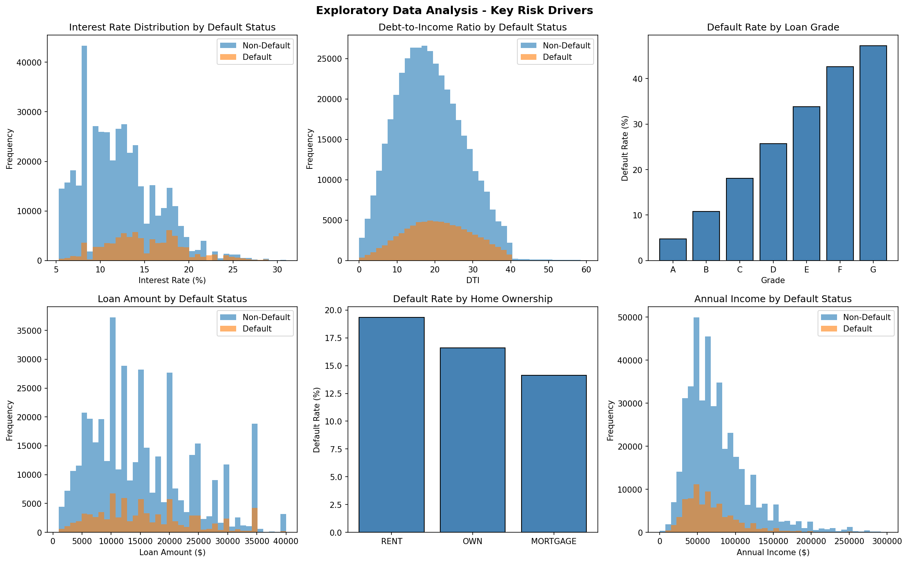
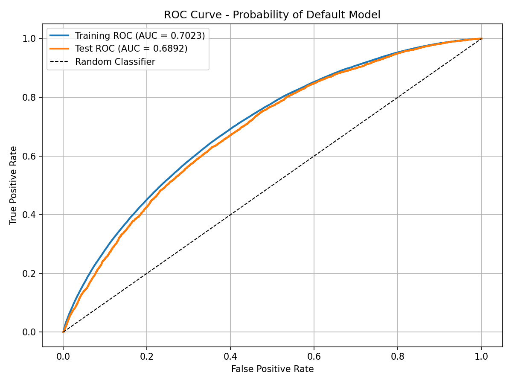
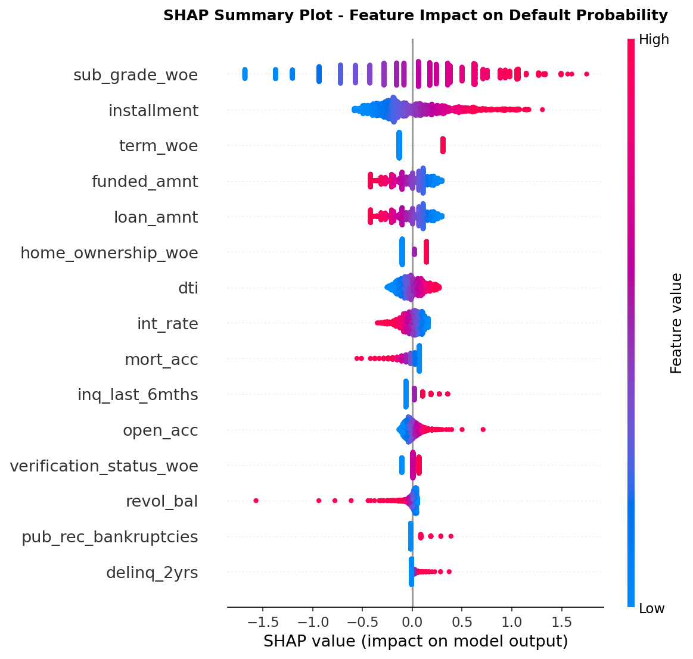
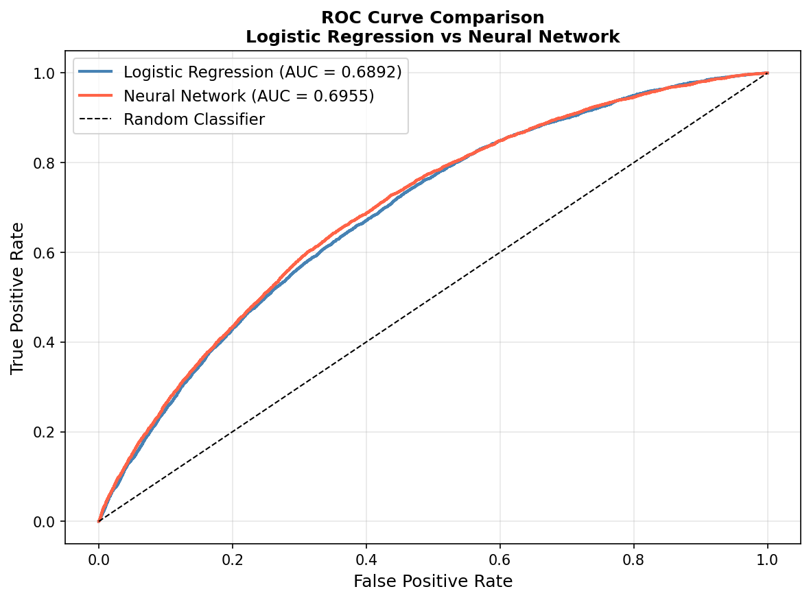
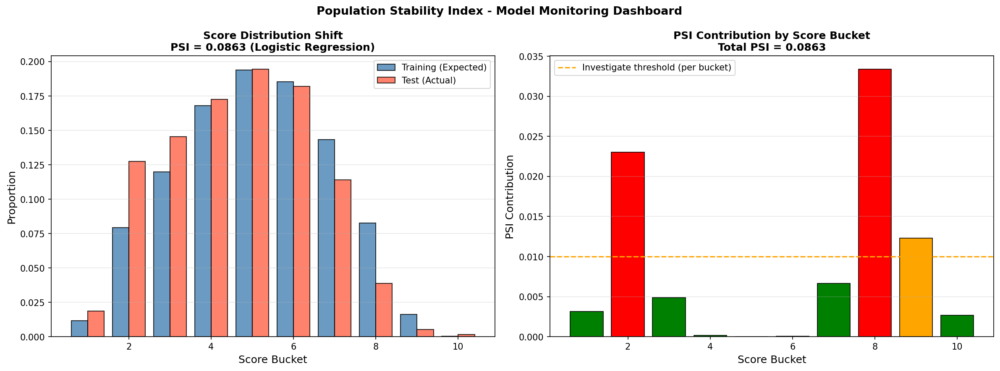

# Credit Risk Analytics System

End-to-end Basel II compliant credit risk modeling pipeline built on the Lending Club dataset (800K+ consumer loans). Implements Probability of Default (PD), Loss Given Default (LGD), and Exposure at Default (EAD) models with SHAP explainability, PyTorch neural network comparison, and Population Stability Index (PSI) monitoring.

---

## Results Summary

| Model | Train AUC | Test AUC | PSI |
|-------|-----------|----------|-----|
| Logistic Regression (PD) | 0.7059 | 0.6892 | 0.0863 |
| Neural Network (PD) | 0.7141 | 0.6955 | 0.0550 |
| LGD Stage 1 Classification | - | 0.7137 | - |
| EAD Linear Regression | - | R2: 0.1885 | - |

---

## Project Structure

```
credit-risk-analytics/
├── notebooks/
│   ├── 01_data_preprocessing.ipynb       # Feature engineering, WoE encoding, Basel II temporal split
│   ├── 02_pd_model_scorecard.ipynb       # PD model, credit scorecard, cutoff analysis
│   ├── 03_lgd_ead_modeling.ipynb         # LGD/EAD modeling, Expected Loss, stress testing
│   ├── 04_shap_explainability.ipynb      # SHAP global/local explanations, adverse action notices
│   └── 05_pytorch_nn_comparison.ipynb    # PyTorch NN vs logistic regression, PSI monitoring
├── requirements.txt
└── README.md
```

---

## Visualizations

### Exploratory Data Analysis


### PD Model ROC Curve


### SHAP Explainability


### Neural Network vs Logistic Regression


### PSI Monitoring Dashboard


---

## Notebooks Overview

### 01 - Data Preprocessing
- Loads 500K Lending Club loans (2007-2018)
- Defines default under Basel II criteria (90+ days past due or charged off)
- Handles class imbalance (5:1 ratio) through weighted loss in modeling stage
- Weight of Evidence (WoE) encoding for categorical features with Information Value analysis
- Temporal train/test split: Train 2007-2015, Test 2016-2018 (no data leakage)

### 02 - PD Model and Scorecard
- Logistic regression with custom weighted loss (class_weight='balanced')
- ROC-AUC: 0.7023 (train), 0.6892 (test)
- KS Statistic: 0.2928 (train), 0.2766 (test)
- Gini Coefficient: 0.4045 (train), 0.3784 (test)
- Credit scorecard converting PD to interpretable 223-831 score range
- Cutoff analysis: score of 600 yields 56.7% approval rate at 10.6% default rate

### 03 - LGD, EAD and Expected Loss
- Two-stage LGD model: Stage 1 classification (AUC 0.7137) + Stage 2 regression
- Grade-level historical average LGD (40.07% Grade A to 47.47% Grade G)
- Grade-level EAD rate (53.77% Grade A to 83.94% Grade G)
- Expected Loss = PD x LGD x EAD: Mean EL $2,047 per loan, Total Portfolio EL $862M
- Stress testing: 295% EL increase under extreme scenario (3x PD, 2x LGD)

### 04 - SHAP Explainability
- LinearExplainer SHAP values on 2000 loan sample
- Global importance: sub_grade_woe dominant (mean abs SHAP 0.5413)
- Local explanations: waterfall plots for individual loan decisions
- Adverse action notices for regulatory compliance (GDPR Article 22, ECOA)
- SHAP vs coefficient ranking: top 5 features identical confirming model consistency

### 05 - PyTorch Neural Network and PSI Monitoring
- 3-layer neural network (64-32-16 neurons) with BatchNorm and Dropout
- Custom weighted BCE loss addressing 5:1 class imbalance (pos_weight=4.4x)
- Neural network test AUC 0.6955 vs logistic regression 0.6892
- PSI monitoring: both models stable (PSI < 0.1) between training and test periods
- Quarterly PSI trend simulation showing gradual drift detection over 2016-2018

---

## Key Concepts

**Basel II Compliance**
The temporal train/test split (2007-2015 train, 2016-2018 test) follows Basel II out-of-time validation requirements. LGD and EAD use grade-level historical averages consistent with the Foundation IRB approach for retail portfolios.

**Custom Weighted Loss**
Both logistic regression and neural network use weighted loss functions to prevent majority class collapse. The positive class weight (4.4x) is derived from the training data imbalance ratio.

**SHAP Explainability**
SHAP values provide loan-level adverse action notices satisfying GDPR Article 22 and SR 11-7 Model Risk Management guidelines for explainable automated credit decisions.

**PSI Monitoring**
Population Stability Index tracks score distribution shift between training and production populations. PSI below 0.1 indicates model stability; above 0.2 triggers recalibration.

---

## Dataset

Source: [Lending Club Loan Data](https://www.kaggle.com/datasets/wordsforthewise/lending-club)
- 800K+ consumer loans issued 2007-2018
- 150+ features including credit history, employment, loan characteristics
- Download and place `accepted_2007_to_2018Q4.csv.gz` in `data/` folder

---

## Setup

```bash
# Clone repository
git clone https://github.com/karthik-1604/Credit-Risk-Analytics.git
cd Credit-Risk-Analytics

# Create virtual environment
python -m venv venv
venv\Scripts\activate  # Windows
source venv/bin/activate  # Mac/Linux

# Install dependencies
pip install -r requirements.txt

# Run notebooks in order
# Start with 01_data_preprocessing.ipynb
```

---

## Technologies

Python, scikit-learn, PyTorch, SHAP, pandas, NumPy, matplotlib, seaborn